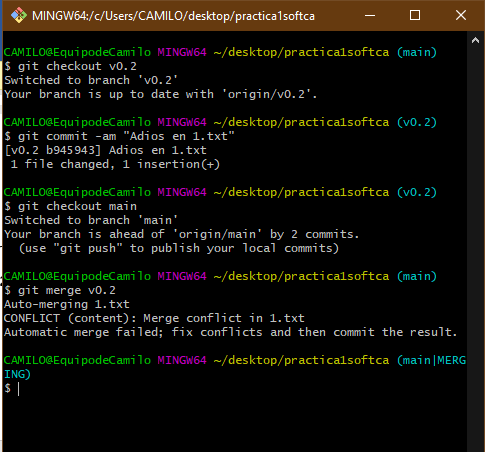

# Practica1Softca
practica git sofcaribbean

Comandos:

git clone
git status
git commint -m "mi primer commit" 
git remote add origin 

5.
git push origin main

10.
git tag v0.1

11.
git add .
git commit -m "modificaciones"
git push origin main

12.
git branch v0.2

13.
git checkout v0.2

15.
git status
git add .
git commit -m "fichero 2.txt creado"
git push --set-upstream origin v0.2

16.
git checkout main

17.
git merge v0.2

20.

